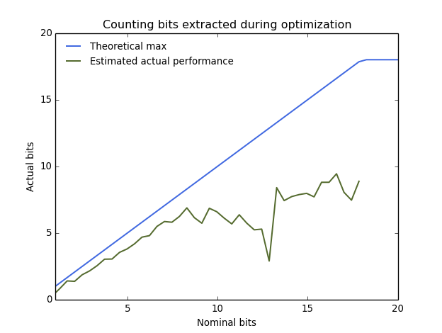
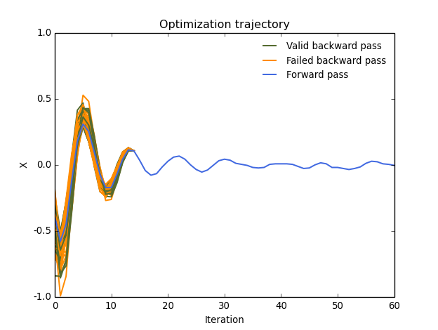

# Tasks

### Experiments
* Illustrate early stopping and comparison between training loss, validation
  loss, actual KL divergence and our bound on the KL divergence.

--------------------------------------------------------------------------------
* Demonstrate perfect sampling
* Show convergence to unidentifiable minima and the N! floor
* Helmholtz machine??

### Engineering
* Implement LIFO arithmetic coding.

### Technical problems to figure out
* What knobs besides number of iters do we have to optimize our new variational objective?
* How can we adaptively chose e.g. alpha and beta without foiling reversibility.
* Can we "get credit" for the extra entropy injected by MCMC?
  Or is beta > 1 the only way to guarantee an entropy increase?
* Figure out how to do LIFO arithmetic coding.

--------------------------------------------------------------------------------
* Work out how to handle HMC's accept/reject step.
* Formalize an "almost perfect sample", where 1-epsilon of initializations
  lead to the same point.
* Can we formalize the probabilistic upper bound on the entropy?
* Can we prove that perfect sampling / convergence is possible in the convex
  case?
* Is there any way to estimate the actual entropy without paying a penalty
  that's exponential in the gap between the actual entropy and the theoretical
  minimum entropy?

# Feb 13

Polling the group, the variational interpretation of early stopping seems the
most popular. Let's do some experiments and see how it looks in practice.

# Feb 10

### Ideas as they stand now:
* We can store the bits coming out of gradient descent or HMC in an information
  buffer and exactly reverse the dynamics if we want to.
* We can lower bound the entropy of the remaining distibution as the difference
  between the bits we've added (at initialization or at MCMC iterations) and the
  bits we've removed.
* We can see whether this lower bound is tight by randomizing the information
  buffer, reversing the dynamics, and seeing whether we get back to one of the
  possible initializations.

### What can we do with all this?
* We can verify (probabilistically) whether we have a perfect sample or prefect
  convergence.
* We can turn HMC or gradient descent into a variational distribution and
  compute an upper bound on the KL divergence from the variational
  distribution to the true distribution (up to a normalization term).
* We can give a rationalization of early stopping in terms of variational
  inference.

### First experiment - optimizing a 1-D parabola

That was using beta = 0.5 (so exactly a bit per iteration). Here's the same
thing with beta = 0.75:

